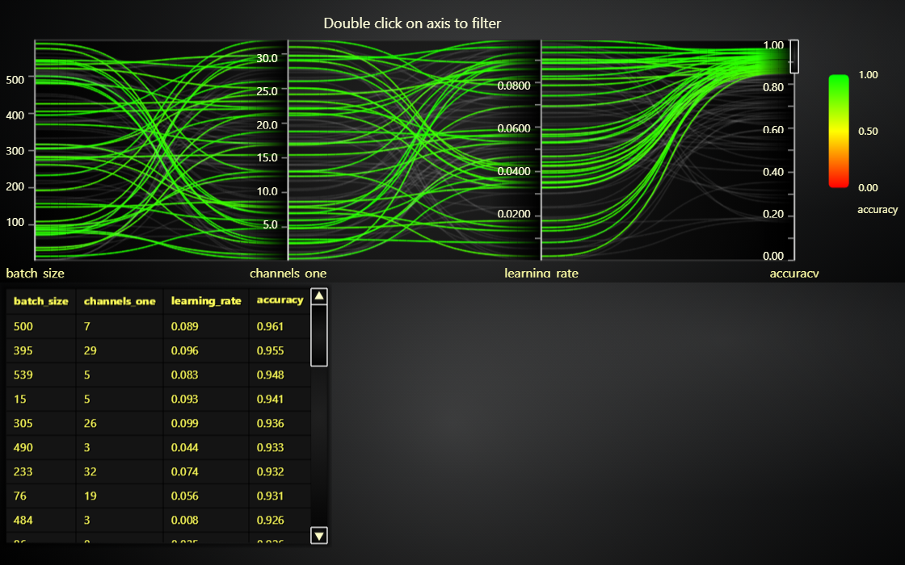

# Parallel Coordinate Chart with Range selector and Data Grid

This demo application belongs to the set of examples for LightningChart JS, data visualization library for JavaScript.

LightningChart JS is entirely GPU accelerated and performance optimized charting library for presenting massive amounts of data. It offers an easy way of creating sophisticated and interactive charts and adding them to your website or web application.

The demo can be used as an example or a seed project. Local execution requires the following steps:

-   Make sure that relevant version of [Node.js](https://nodejs.org/en/download/) is installed
-   Open the project folder in a terminal:

          npm install              # fetches dependencies
          npm start                # builds an application and starts the development server

-   The application is available at _http://localhost:8080_ in your browser, webpack-dev-server provides hot reload functionality.

## Description

Parallel coordinate chart has a powerful data analysis tool built-in - _Range Selectors_.

A range selector defines a value range `[start, end]` along 1 specific Axis, and highlights the series whose value is within that range.

Range selectors can be created in two ways:

1. Built-in user interaction, double click on any Axis to create a Range selector there.

2. Programmatically, using `Axis.addRangeSelector` method.

Range selectors can also be freely moved/resized by dragging on them, or deleted by double clicking on one.
This makes Range selectors a powerful exploratory data analysis tool that allows the user to find relations in data.

You can also connect custom data analysis scripts to interact with the user interactions.
In this example, the currently highlighted series are displayed in an adjacent `DataGrid`.

If the chart contains several Range selectors, then only series that pass all the conditions are highlighted.

## API Links

## Support

If you notice an error in the example code, please open an issue on [GitHub][0] repository of the entire example.

Official [API documentation][1] can be found on [LightningChart][2] website.

If the docs and other materials do not solve your problem as well as implementation help is needed, ask on [StackOverflow][3] (tagged lightningchart).

If you think you found a bug in the LightningChart JavaScript library, please contact sales@lightningchart.com.

Direct developer email support can be purchased through a [Support Plan][4] or by contacting sales@lightningchart.com.

[0]: https://github.com/Arction/
[1]: https://lightningchart.com/lightningchart-js-api-documentation/
[2]: https://lightningchart.com
[3]: https://stackoverflow.com/questions/tagged/lightningchart
[4]: https://lightningchart.com/support-services/

© LightningChart Ltd 2009-2022. All rights reserved.

